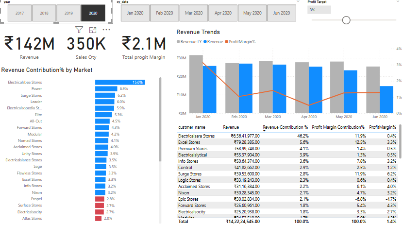

# 📊 Sales insights Dashboard  

## 📌 Overview  
This repository contains a **Power BI Dashboard** for analyzing **Sales Performance, Revenue Contribution, and Profit Margins** across different markets and customers.  

The dashboard provides interactive insights into:  
- Revenue growth trends  
- Sales quantity performance  
- Profit margin analysis  
- Market contribution breakdown  
- Customer-level revenue & profitability insights  

---

## 🖼️ Dashboard Previews  
### Dashboard 1  
  

### Dashboard 2  
  

---

## 🚀 Features  
- **Revenue Trends**: Compare monthly revenue with last year and track profit margins.  
- **Market Contribution %**: Visualize top-performing markets by revenue share.  
- **Customer Analysis Table**: Drill down into revenue, contribution %, and profit margin %.  
- **Filters**: Select year, month, and profit target for customized views.  

---

## 📈 Key Metrics  
- **Revenue**: ₹985M  
- **Sales Quantity**: 2M units  
- **Total Profit Margin**: ₹24.7M  
- **Top Market Contributor**: *Leader (7.5%)*  
- **Top Customer Contributor**: *Electricalsara Stores (42%)*  

---

## 🛠️ Tools & Technologies  
- **Power BI** – Data Visualization & Dashboarding  
- **Excel / SQL** – Data Processing (upstream)  
- **DAX** – Measures and Calculations  

---

## 🔮 Future Enhancements  
- Add drill-through for detailed product-level analysis  
- Automate data refresh with SQL/ETL pipeline  
- Integrate forecasting models for revenue trends  

---

## 📜 License  
This project is licensed under the MIT License – feel free to use and modify.  

---

👉 If you find this project useful, don’t forget to ⭐ the repo!  
